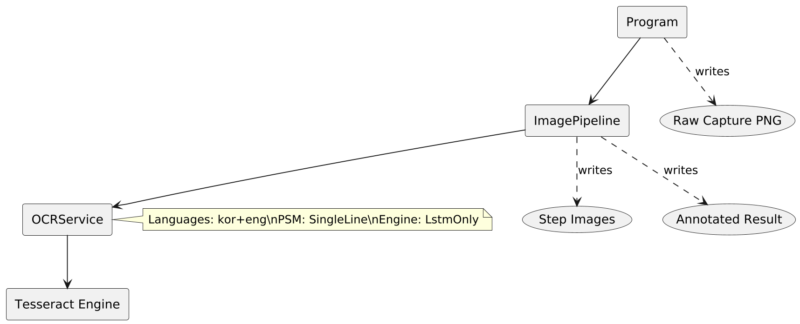
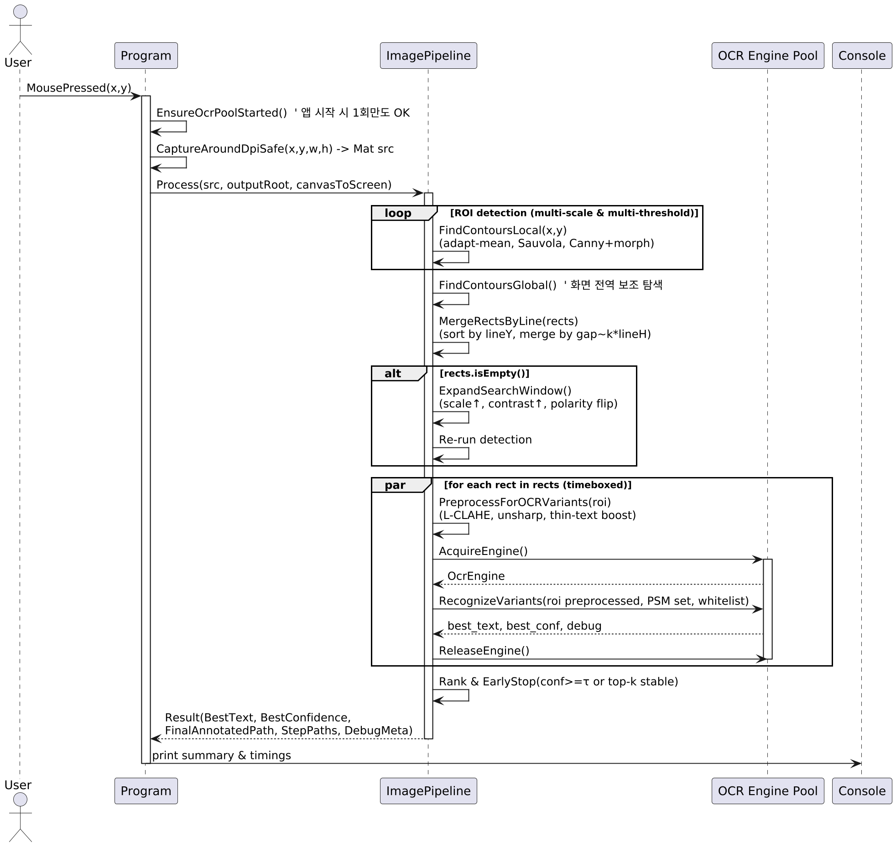

## OCRPipeline: Image to Text Pipeline (KR/EN)

### 개요 (Overview)

- **설명 (KR)**: 이 프로젝트는 화면 캡처된 이미지를 기반으로, 텍스트 후보 영역을 탐지하고 다양한 이진화/전처리를 거친 뒤 Tesseract OCR로 인식하여 최적의 결과를 선택합니다. 클릭 기반 ROI(관심 영역) 탐색과 전역 컨투어 기반 탐색을 혼합해 작은 글자/저대비 텍스트까지 포착합니다.
- **Description (EN)**: This project captures a screen region, detects text-like regions via contour analysis and multiple binarization strategies, then recognizes text using Tesseract OCR. It blends click-centered ROI exploration with global contour search to robustly handle small or low-contrast text.

## 아키텍처 (Architecture)

### 구성 요소 (Components)

- **`Program`**: 전역 마우스 훅을 등록하고, 클릭 시 화면을 캡처합니다. 캡처 이미지를 `ImagePipeline.Process`에 전달하고 결과를 콘솔에 출력합니다.
- **`ImagePipeline`**: 텍스트 후보영역을 찾기 위한 컨투어 탐색과 전처리를 수행하고, `OCRService`를 이용해 여러 후보에 대해 OCR을 수행한 뒤 최고 점수를 선택합니다. 중간 산출물과 최종 어노테이션 이미지를 저장합니다.
- **`OCRService`**: Tesseract 엔진을 구성(언어, PSM, 엔진 모드)하고, `Mat` 입력을 바로 OCR 처리합니다.

### 컴포넌트 다이어그램 (PlantUML)

## 데이터 흐름 (Data Flow)

### 시퀀스 (Sequence, PlantUML)

### 주요 단계 (Key Steps)

- **Capture**: 클릭 좌표 중심으로 DPI-safe 캡처.
- **ROI 기반 다중 이진화**: ROI에서 Adaptive Mean(Binary/BinaryInv) + Sauvola 임계값으로 세 가지 마스크 생성.
- **컨투어 탐색 및 필터링**: 면적/종횡비/전역면적 비율로 후보 박스 필터링, 라인 병합.
- **전처리**: 업스케일 → Lab L 채널 → TopHat/BlackHat 대비 보강 → CLAHE → GaussianBlur → 얇은 글자 보강(dilate/open) → 저장.
- **OCR 및 선택**: 후보마다 OCR 실행, 한글/영문 여부 검사, 평균 신뢰도(%)가 최고인 결과를 선택.
- **어노테이션**: 모든 컨투어를 파랑 사각형, 최고 박스를 빨간 사각형으로 표시하고 텍스트/신뢰도 라벨링.

## 수학적/행렬 연산 설명 (Math and Linear Algebra)

### 1) 좌표계와 아핀 변환 (Coordinate Systems and Affine Transform)

- **`canvasToScreen`**는 2×3 아핀 행렬 `A = [ a11 a12 tx; a21 a22 ty ]`로 표현됩니다.
- 점 \\( \mathbf{x} = [x, y]^T \\)에 대한 변환은 \\[ \mathbf{x}' = A_{2\times2} \mathbf{x} + \mathbf{t},\quad A_{2\times2} = \begin{bmatrix} a_{11} & a_{12} \\ a_{21} & a_{22} \end{bmatrix},\ \mathbf{t}=[t_x, t_y]^T. \]
- ROI 내부 컨투어 박스 \\( r = (x, y, w, h) \\)를 전체 좌표로 옮길 때는 본 코드에서 ROI 오프셋을 단순 가산: \\[ r' = (x+\mathrm{roiX},\ y+\mathrm{roiY},\ w,\ h). \]

### 2) 업스케일과 리샘플링 (Upscale and Resampling)

- 스케일 팩터 \\( s > 0 \\)일 때, 이미지 좌표는 \\[ \begin{bmatrix}x'\\y'\end{bmatrix} = s \cdot \begin{bmatrix}x\\y\end{bmatrix}. \]
- Lanczos4 인터폴레이션은 band-limited 가정에서 고주파 보존을 돕습니다.

### 3) 대조/형태학적 연산 (Contrast and Morphology)

- TopHat/BlackHat은 구조요소 \\(K\\)에 대한 형태학적 필터로, 작은 밝기/어둠 구조를 강조합니다. 이는 컨볼루션적 관점에서 국소 구조 강조로 볼 수 있습니다.
- 얇은 글자 보강은 **팽창(dilation)**과 **열기(opening)** 연산을 사용합니다. 팽창은 \\( M \oplus K \\), 열기는 \\((M \ominus K) \oplus K\\) 형태로 서술됩니다. 여기서 \\(M\\)은 바이너리 마스크, \\(K\\)는 구조요소입니다.

### 4) 이진화 (Binarization)

- Adaptive Mean: 블록 평균 \\( m \\)과 오프셋 \\(C\\)로 임계값을 \\( T = m - C \\)로 둡니다. 픽셀 밝기 \\(I(x,y)\\)에 대해 \( I > T \Rightarrow 255 \) (Binary), \( I \le T \Rightarrow 255 \) (BinaryInv).
- Sauvola: 표준편차 \\( s \\), 동적 범위 \\( R \\), 상수 \\( k \\)에 대해 임계값은 \\[ T = m \Big( 1 + k (\frac{s}{R} - 1) \Big). \]
- 본 구현은 회색 영상의 지역 평균/분산을 컨볼루션(블러)로 근사하여 \\( m, s \\)를 계산합니다.

### 5) 컨투어와 박스 병합 (Contours and Line Merge)

- 외곽선 검출로 얻은 바운딩 박스 집합 \\( \{r_i\} \\)에 대해, 같은 줄(y-중첩 비율)로 묶고 x-간극이 \\( \le h \cdot \alpha \\)이면 병합합니다. 코드의 `xGapFactor = \alpha`입니다.
- 병합은 최소 포괄 사각형 연산으로 구현됩니다: \\[ r_{merge} = \mathrm{BBox}(r_i, r_{i+1}). \]

### 6) 스코어링 및 선택 (Scoring and Selection)

- `OCRService`의 평균 신뢰도 \\( c \in [0,100] \\)와 한글/영문 문자 존재 여부를 이용해 후보 중 최고 \\( c \\)를 선택합니다.
- 유효 문자 판단은 코드포인트 범위(영문 A–Z, a–z, 한글 음절 AC00–D7A3)를 검사합니다.

## 사용법 (Usage)

### 실행 (Run)

1. `tessdata` 폴더가 실행 디렉터리에 존재해야 합니다. 코드에서 `TESSDATA_PREFIX`를 해당 경로로 설정합니다.
2. 애플리케이션을 실행하면 전역 마우스 훅이 활성화됩니다.
3. 마우스를 클릭하면 해당 위치 주변이 캡처되고, 다단계 OCR 파이프라인이 수행됩니다.
4. 콘솔에 최고 텍스트와 신뢰도가 출력되며, `outputs/`와 `raws/` 폴더에 결과 이미지가 저장됩니다.
5. ESC로 종료합니다.

### 빌드 의존성 (Dependencies)

- .NET (C#), OpenCvSharp, Tesseract 4+, SharpHook
- 언어 데이터: `kor.traineddata`, `eng.traineddata`

## 출력물 (Outputs)

- `raws/raw_*.png`: 원본 캡처
- `outputs/<run>/roi_bin_*.png`: ROI 이진화 결과(밝은/어두운/ Sauvola)
- `outputs/<run>/preprocess_*.png`: 전처리 스텝 이미지
- `outputs/<run>/contours_*.png`: 전체 컨투어 어노테이션
- `outputs/<run>/final_result_*.png`: 최종 결과 어노테이션

## 설계 세부 (Design Details)

- `Program.OnMousePressed`
  - 멀티클릭 쓰로틀링으로 동시 실행 방지
  - DPI-safe 캡처(`CaptureUtil.CaptureAroundDpiSafe`) → `Mat` 변환
  - `ImagePipeline.Process` 호출 후 결과를 출력/저장

- `ImagePipeline.Process`
  - ROI multi-thresholding을 4회(작은 무작위 시프트) 반복하여 다양한 조명/극성에 대응
  - 전역 컨투어 탐색을 추가하여 ROI 밖 텍스트도 포착
  - 전처리 파이프라인으로 얇은 글자/저대비 텍스트를 보강한 뒤 OCR
  - 최고 신뢰도 텍스트와 해당 박스를 최종 강조

- `OCRService`
  - `Pix.LoadFromMemory`를 통해 중간 파일 없이 바로 OCR 수행
  - `PageSegMode.SingleLine`, `EngineMode.LstmOnly` 기본값 사용
  - `TrimConcatenatedText`로 후처리(공백/특수문자 제거 옵션 함수)

## 문제와 해결 (Issues and Resolutions)

### 문제 1: 커서 중심 ROI에서 컨투어가 의도대로 잡히지 않음

- **증상 (KR)**: 클릭 좌표 주변의 작은 텍스트가 배경 대비/극성에 따라 누락되거나, 버튼 전체 박스가 잡혀 텍스트 영역이 묻힘.
- **Symptom (EN)**: Near the cursor, small text was missed due to polarity/contrast or merged into large UI boxes.

**원인 분석 (Root Cause)**
- ROI가 단일 임계전략에 의존하면 배경-전경 극성 변화(밝은 글자 vs 어두운 글자)에 취약.
- ROI가 고정일 때 경계 근처 텍스트가 잘리는 문제.
- 팽창 커널이 과대하면 텍스트가 UI 컨테이너와 합쳐져 대형 박스로 변형.

**해결 (Fixes)**
- ROI 다중 시프트: `FindContoursAroundCursorMulti`에서 (dx, dy) 무작위 시프트를 4회 적용하여 경계 손실을 감소.
- 다중 이진화: Adaptive Mean Binary/BinaryInv + Sauvola 3종 마스크 생성으로 극성/조명 변화 대응.
- 라인 병합 제한: `xGapFactor`와 종횡비/면적 상한(`MaxAreaRatio`)을 조정해 과도 병합을 억제.
- 얇은 글자 보강: 업스케일과 가로형 팽창 커널로 소문자/세리프 등을 보강하되, 후속 `open`으로 노이즈 제거.
- 전역 패스 추가: ROI 외부 텍스트를 위해 전체 프레임 컨투어링을 1회 수행해 보조 신호 확보.

### 문제 2: 노이즈 패턴으로 인한 잘못된 컨투어 다수 발생

- **증상 (KR)**: 패턴성 배경(그리드, 디더링)에서 작은 박스가 과도 검출.
- **Symptom (EN)**: Patterned background produced many false positives.

**해결 (Fixes)**
- `ScoreMaskForText`로 전경-배경 밸런스와 글자 유사 CC 수 기반 스코어링, 더 나은 극성 마스크 선택.
- 최소 면적/종횡비 필터 재チ유닝: `MinArea`, `MinAspectRatio`, `MaxAspectRatio` 조정.
- 가로 연결 전용 팽창 커널을 사용해 횡렬 텍스트 위주 결합을 유도, 세로 노이즈는 억제.

## 심화 수학: 컨투어링부터 최종 전처리까지 (Advanced Math: From Contouring to Preprocessing)

아래 표기에서 입력 영상은 \( I: \Omega \subset \mathbb{Z}^2 \to \{0,\dots,255\} \) 입니다.

### A) ROI 시프트와 결합 (ROI Shifts and Union)

- ROI 중심 \( (x_c, y_c) \)와 크기 \( (w,h) \). 시프트 집합 \( S = \{(\Delta x_i, \Delta y_i)\}_{i=1}^N \).
- 각 시프트의 ROI: \( R_i = [x_c - w/2 + \Delta x_i,\ x_c + w/2 + \Delta x_i) \times [y_c - h/2 + \Delta y_i,\ y_c + h/2 + \Delta y_i) \).
- 컨투어 후보의 전체 좌표 보정: \( r' = r + (\mathrm{roiX}_i, \mathrm{roiY}_i) \).

### B) 지역 이진화 (Local Binarization)

1. Adaptive Mean (block size \(B\), offset \(C\)):
   - 지역 평균 \( m(x,y) = \frac{1}{|\mathcal{N}_B|} \sum\limits_{(u,v)\in \mathcal{N}_B(x,y)} I(u,v) \)
   - 임계값 \( T(x,y) = m(x,y) - C \)
   - 마스크 \( M_{bin}(x,y) = \mathbb{1}[I(x,y) > T(x,y)] \), \( M_{inv} = 1 - M_{bin} \)

2. Sauvola (표준편차 \( s \), 동적 범위 \(R\), 상수 \(k\)):
   - 분산 \( \sigma^2 = E[I^2] - (E[I])^2 \), \( s = \sqrt{\max(\sigma^2, 0)} \)
   - \( T(x,y) = m(x,y)\left(1 + k\big(\frac{s(x,y)}{R} - 1\big)\right) \)
   - \( M_{sau}(x,y) = \mathbb{1}[I(x,y) > T(x,y)] \)

세 마스크에 대해 형태학적 수평 팽창을 적용: \( M' = M \oplus K_h \), \( K_h = \mathbf{1}_{\{0,\dots,w_k\}\times\{0\}} \)

### C) 컨투어 추출과 필터링 (Contours and Filtering)

- 외곽선 집합 \( \mathcal{C} = \mathrm{FindContours}(M') \), 각 컨투어의 바운딩 박스 \( r(c) = \mathrm{BBox}(c) \).
- 면적/비율 필터:
  - \( A(r) = w\cdot h \ge A_{\min} \)
  - \( A(r) \le \rho_{\max} \cdot A_{img} \)
  - 종횡비 \( \alpha(r) = \frac{w}{h} \in [\alpha_{\min}, \alpha_{\max}] \)

### D) 라인 병합 (Line-wise Merging)

- 같은 줄 판정: \( \frac{\text{overlap}_y(r_i, r_j)}{\min(h_i, h_j)} \ge \tau_y \)
- x-간극: \( g = x_j - (x_i + w_i) \)
- 병합 조건: \( g \le \lambda \cdot \min(h_i, h_j) \)이면 최소 포괄 사각형으로 병합: \( r_{ij} = \mathrm{BBox}(r_i, r_j) \)

### E) 전처리 파이프라인 (Preprocessing Pipeline)

1. 업스케일: \( I_1(x,y) = I(sx, sy) \) with Lanczos4.
2. 색공간 변환: Lab 분해 후 L채널 \( L = \mathrm{Lab}(I_1).L \).
3. 형태학적 대비 강화: \( E = L + a\cdot \mathrm{TopHat}(L) - b\cdot \mathrm{BlackHat}(L) \).
4. CLAHE: \( E' = \mathrm{CLAHE}(E) \) (국소 히스토그램 평활화로 대비 향상).
5. 디노이즈: \( D = G_{\sigma} * E' \) (가우시안 블러 컨볼루션).
6. 얇은 글자 보강: 수평 팽창 후 작은 구조요소로 opening: \( B = (D \oplus K_h) \circ K_s \).

결과 \( B \)는 OCR 입력으로 전달됩니다.

### F) OCR 선택 기준 (OCR Selection)

- 후보 \( r_k \)에 대해 텍스트 \( t_k \)와 신뢰도 \( c_k \)를 얻고, 유효문자 검사 함수 \( \phi(t) \)가 참이며 \( c_k \)가 최대인 \( k^* = \arg\max c_k \)를 선택.
